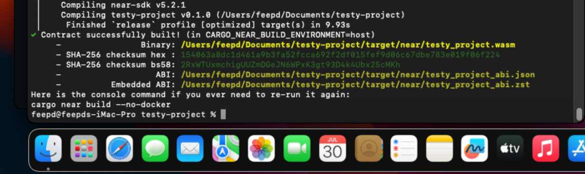

### 1. `--no-docker` build on `cargo near new` project

### 2. docker build on https://github.com/dj8yfo/sample_workspace/tree/580e67ea792351be1b0313931159ed62f098b702 => ??? `test-docker-dep-windows.testnet`

