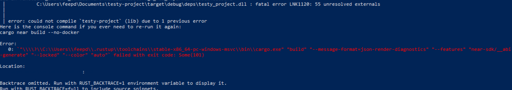
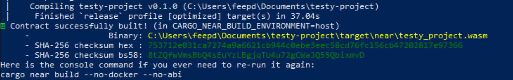
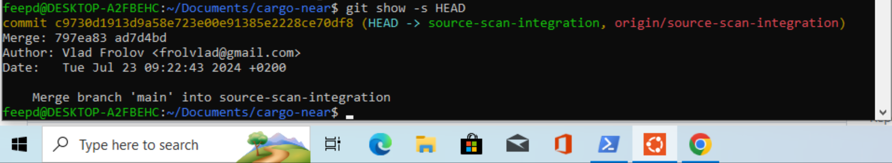
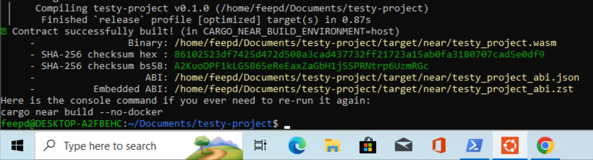
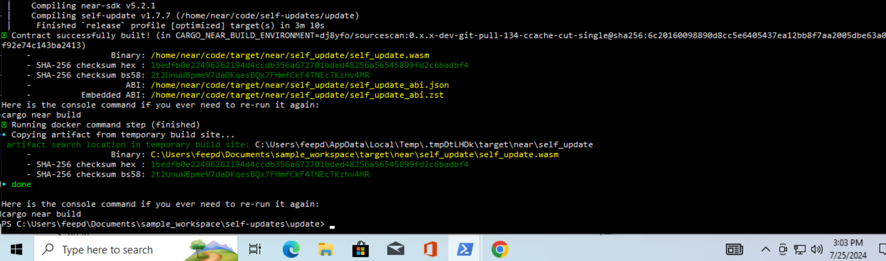
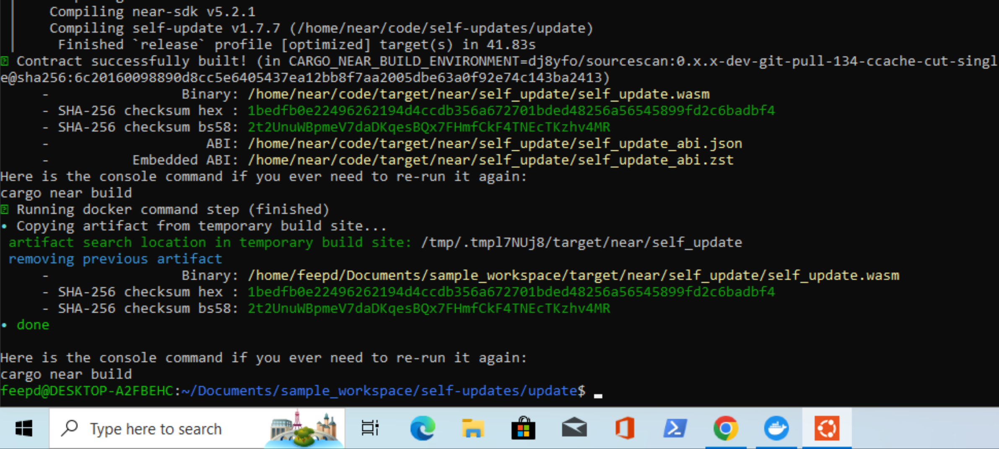

1. `--no-docker` (no WSL) build on `cargo near new` project

Similar behaviour with [issue](https://github.com/near/cargo-near/issues/188)



2. `--no-docker --no-abi` (no WSL) build on `cargo near new` project

Similar behaviour with [issue](https://github.com/near/cargo-near/issues/188)



3. `--no-docker` (in WSL) build on `cargo near new` project




4. docker (WSL 2 backend) build on https://github.com/dj8yfo/sample_workspace/tree/580e67ea792351be1b0313931159ed62f098b702 => `test-docker-dep-windows.testnet`




5. docker (Hyper-V backend) build 

The Hyper-V role cannot be installed on Windows 10 Home.

6. docker (from WSL) with docker *integrations with WSL2* distros enabled

it may be advisable to add the following to https://docs.near.org/blog/getting-started-on-windows to be able to use this flow


```bash
wsl --set-default-version 2
```


